# mosq-forecast
## ESTCAMP AI 모델개발 2차 프로젝트
**기후 데이터 기반 하천별 모기 발생량 예측 모델**

본 프로젝트는 기후 변화에 따른 모기 활동 시기 및 개체수 변동을 분석하여, 효율적인 방역 대책 수립을 위한 데이터 기반의 의사결정 근거를 마련하고자 기획되었습니다. 서울시를 대표하는 3대 하천인 탄천, 중랑천, 안양천의 기상 관측 데이터와 모기 지수를 결합하여 시계열 예측 모델인 LSTM을 구축하고 학습시켰습니다.

단순한 마릿수 예측의 정밀도를 넘어, 모기 개체수가 급증하거나 급감하는 **시계열적 흐름(Trend)** 을 파악하는 데 중점을 두었습니다. 비록 방역 데이터와 같은 인위적 억제 변수의 부재로 인해 수치적 오차가 발생했으나, 개체수 변동의 주요 변곡점을 유연하게 추종함으로써 향후 실무적인 조기 경보 시스템으로의 발전 가능성을 확인했습니다.

## 이상치 확인 및 처리
<table>
  <tr>
    <td width="50%">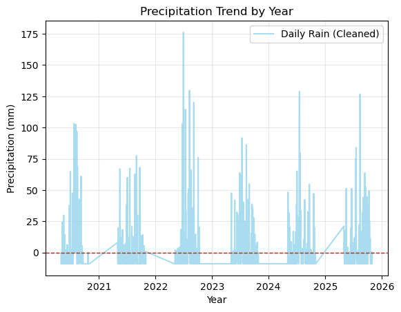</td>
    <td width="50%">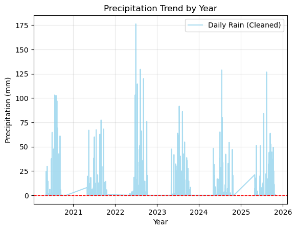</td>
  </tr>
</table>

## EDA Target
 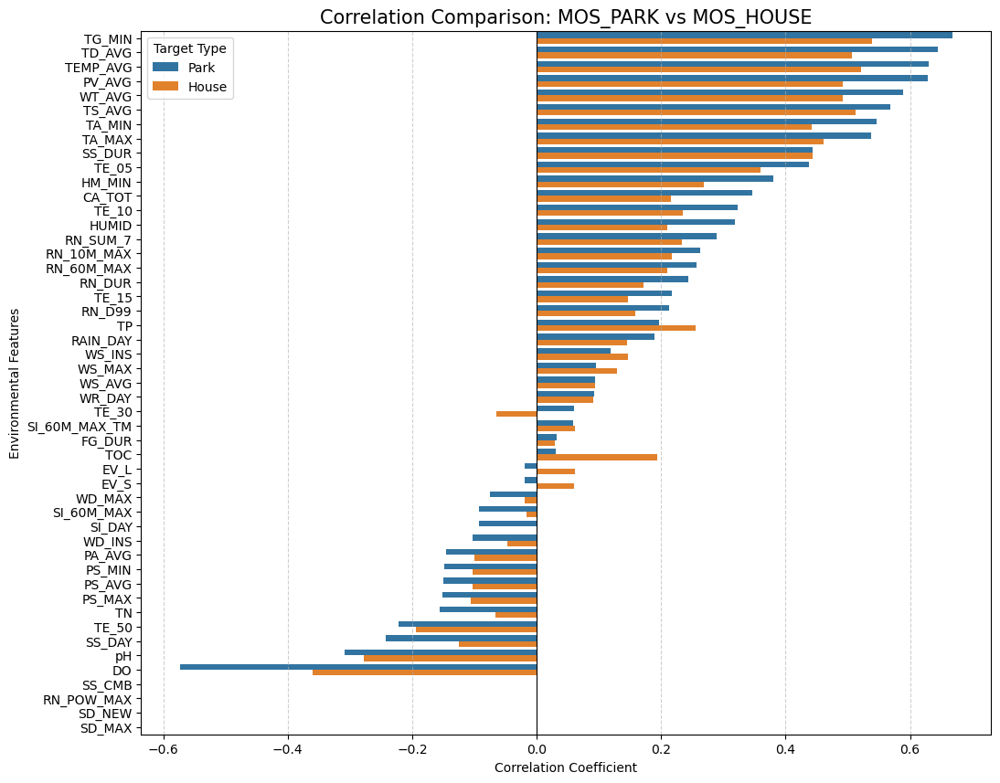

## EDA Train Features
 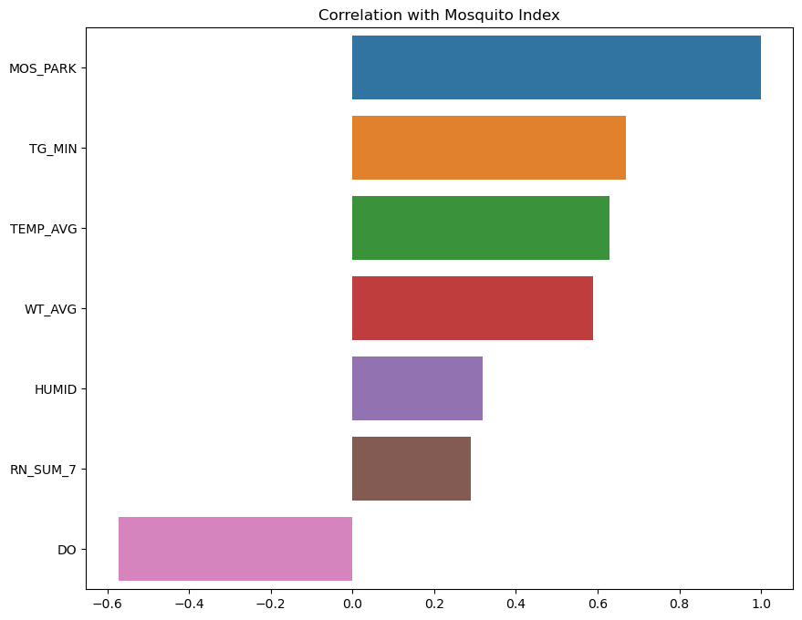

## EDA Train Features Heatmap
 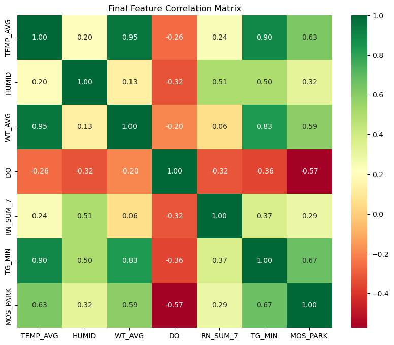

## LSTM 최종 Loss 그래프
 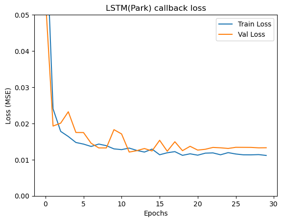

## 예측값, 실제값 비교 그래프
 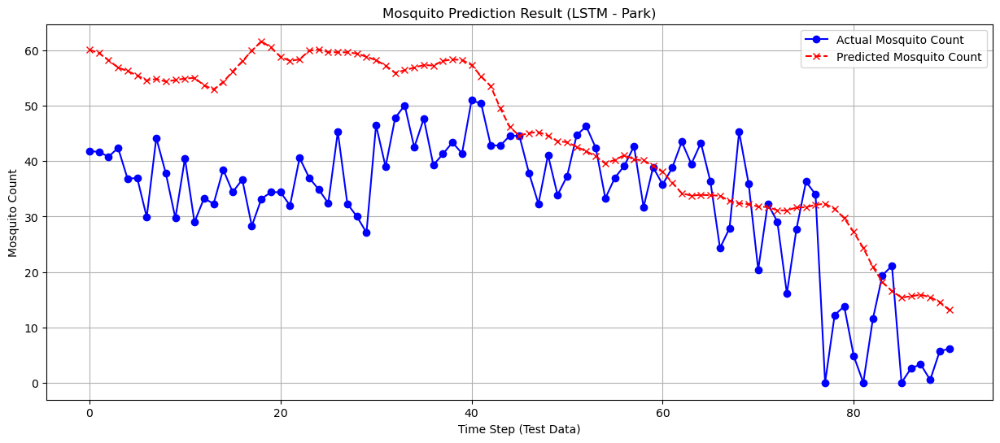

## XGBoost 비교 그래프
 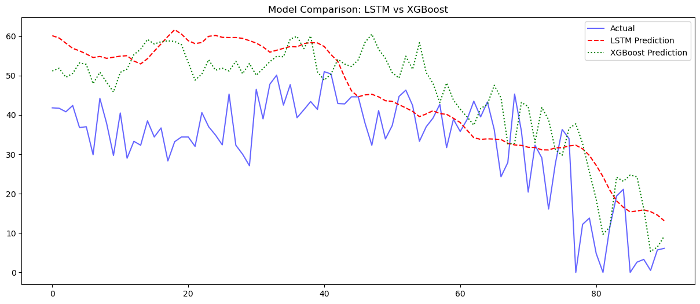

## 성능 지표
 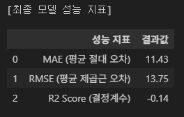

R2 Score가 음수값이 나와서 잔차 분석을 통해 무엇이 문제인지 찾아보자

## 잔차 분석
 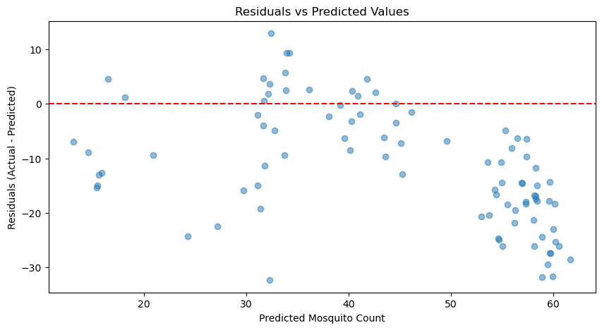

위 그래프는 "예측값에 따라 오차가 어떻게 변하는가"를 보여준다. (오차의 경향성)
- **상향 편향의 시각화** : 대부분의 점이 가로 점선(0) 아래에 위치한다. 잔차가 음수(Actual < Predicted)라는 것은 모델이 실제보다 항상 높게 예측하고 있다는 점이다.
- **우하향 패턴 (Linear Trend)** : 점들이 오른쪽 아래로 기울어져 있다. 이는 예측값이 커질수록(모기가 많다고 할수록) 실제값과의 차이(오버슈팅)가 더 벌어지고 있음을 의미한다.

**결론**
---
모델이 기상 변수를 보고 “보기가 늘어난다”는 흐름은 잡았지만, 그 증가 폭을 실제보다 훨씬 과하게 계산하고 있다.

 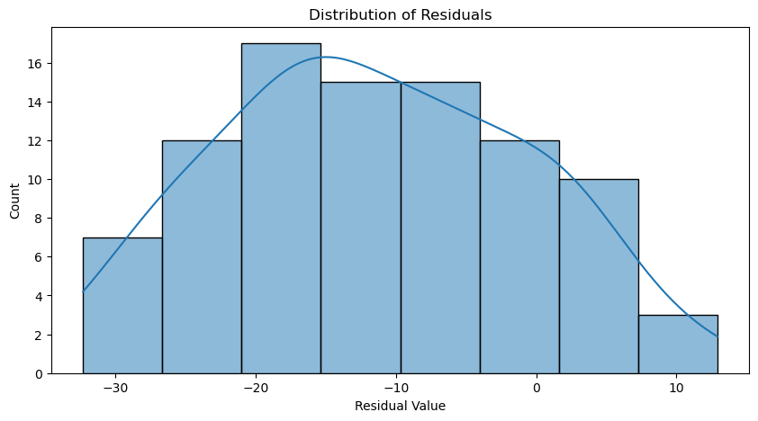

위 히스토그램은 “오차가 어떤 수치에 집중되어 있는가”를 보여준다. (오차의 분포)

- **치우친 중심 (Shifted Mean)** : 좋은 모델이라면 0을 중심으로 종 모양(정규분포)을 그려야 한다. 하지만 현재 그래프의 정점은 -10에서 -15사이에 형성되어 있다.
    - **해석** : 평균적으로 약 11~12 정도를 항상 더 많이 예측하고 있다는 뜻이다.
- **데이터의 특성** : 분포가 0을 향해 길게 꼬리를 늘어뜨린 형태이다. 이는 가끔은 실제값에 근접하게 맞히기도 하지만, 대다수의 데이터에서는 일관되게 높게 예측하는 ‘고질적인 편향’이 있음을 나타낸다.

**결론**
---
학습 피처의 부족으로 보인다. 그중에서도 수치의 억제 변수의 부재로 인해 발생하는 현상으로 보임 일관적으로 11~12정도 높다면 그것을 내릴만한 학습 피처를 구해보는 것도 좋아보임(예: 벌레퇴치기 설치수, 방역활동)
